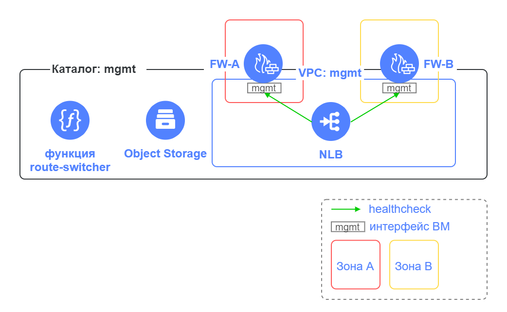

# Реализация защищенной высокодоступной сетевой инфраструктуры с выделением DMZ на основе Смарт-Софт NGFW

## Содержание
- [Описание решения](#описание-решения)
- [Архитектура решения и основные компоненты](#архитектура-решения-и-основные-компоненты)
- [Разворачиваемые сегменты и ресурсы](#разворачиваемые-сегменты-и-ресурсы)
- [Подготовка к развертыванию](#подготовка-к-развертыванию)
- [Развертывание Terraform сценария](#развертывание-terraform-сценария)
- [Действия после развертывания сценария](#действия-после-развертывания-сценария)
- [Подключение к сегменту управления](#подключение-к-сегменту-управления)
- [Настройка NGFW](#настройка-ngfw)
- [Включение работы модуля route-switcher](#включение-работы-модуля-route-switcher)
- [Проверка работоспособности](#проверка-работоспособности)
- [Проверка отказоустойчивости](#проверка-отказоустойчивости)
- [Требования к развертыванию в продуктивной среде](#требования-к-развертыванию-в-продуктивной-среде)
- [Удаление созданных ресурсов](#удаление-созданных-ресурсов)


## Описание решения

Сценарий разворачивает в Yandex Cloud облачную инфраструктуру для решения задач:
- защиты и сегментации инфраструктуры на зоны безопасности
- публикации приложений в интернет из зоны [DMZ](https://ru.wikipedia.org/wiki/DMZ_(компьютерные_сети))
- обеспечения высокой доступности развернутых приложений

Каждый сегмент сети (далее сегмент) содержит ресурсы одного назначения, обособленные от других ресурсов. Например, DMZ сегмент предназначен для размещения общедоступных приложений. В облаке каждому сегменту соответствует свой каталог и своя облачная сеть VPC. Связь между сегментами происходит через виртуальные машины Next-Generation Firewall (NGFW), обеспечивающие комплексную защиту сегментов и контроль трафика между сегментами. 

Высокая доступность архитектуры достигается за счет:
- использования двух NGFW
- размещения ресурсов в двух зонах доступности
- сервиса [Application Load Balancer](#application-load-balancer-alb) для отказоустойчивости и балансировки опубликованных приложений в DMZ
- [Облачной функции](#terraform-модуль-route-switcher) для переключения исходящего из сегмента трафика при отказе NGFW


## Архитектура решения и основные компоненты


<br><br>

Описание элементов схемы:

| Название элемента | Описание | Комментарии |
| ----------- | ----------- | ----------- | 
| VPC: public | Сегмент сети public | Для организации публичного доступа из интернет | 
| VPC: mgmt | Сегмент сети mgmt | Для управления облачной инфраструктурой и размещения служебных ресурсов | 
| VPC: dmz | Сегмент сети DMZ | Для размещения приложений, доступных из интернет | 
| FW-A | Виртуальная машина Смарт-Софт Traffic Inspector Next Generation | Для защиты инфраструктуры и сегментации сети на зоны безопасности. Активен для входящего трафика и исходящего трафика. |
| FW-B | Виртуальная машина Смарт-Софт Traffic Inspector Next Generation | Для защиты инфраструктуры и сегментации сети на зоны безопасности. Активен для входящего трафика и в резерве для исходящего трафика. |
| ALB | Балансировщик нагрузки на FW-A и FW-B | Для балансировки и отказоустойчивости опубликованных в DMZ приложений |
| Функция route-switcher | Облачная функция | Для переключения таблицы маршрутизации в сегменте | 
| Jump ВМ | Виртуальная машина c настроенным [WireGuard VPN](https://www.wireguard.com/) | Для защищенного VPN подключения к сегменту управления |
| NLB | Сетевой балансировщик на группу веб-серверов | Для балансировки трафика на веб-серверы тестового приложения в DMZ сегменте |
| Приложение | ВМ с веб-сервером Nginx | Пример тестового приложения, развернутого в DMZ сегменте |

</details>

Ключевыми элементами решения являются: 
- [Next-Generation Firewall](#next-generation-firewall)
- [Application Load Balancer](#application-load-balancer-alb)
- [Terraform модуль route-switcher](#terraform-модуль-route-switcher)
- [Группы безопасности](#группы-безопасности)

FW-A и FW-B работают в режиме Active/Active для входящего в DMZ трафика и в режиме Active/Standby для исходящего трафика из сегментов.


В случае отказа FW-A сетевая связанность с интернетом и между сегментами будет выполняться через FW-B


### Next-Generation Firewall

NGFW используется для защиты и сегментации облачной сети с выделением DMZ зоны для размещения публичных приложений.
В [Yandex Cloud Marketplace](https://cloud.yandex.ru/marketplace?categories=security) доступно несколько вариантов NGFW.

В данном сценарии развернуто решение [Смарт-Софт Traffic Inspector Next Generation (TING)](https://yandex.cloud/ru/marketplace/products/smartsoft/smart-soft-ting-ngfw-utm-fstek), предоставляющее функционал:
- Межсетевой экран следующего поколения: защищает виртуальную сеть от несанкционированного доступа извне, обеспечивает NAT, проброс портов, перехват пакетов.
- Система обнаружения и предотвращения вторжений: IDS/IPS распознает источники атак и атакуемые устройства по определенным сигнатурам сетевого трафика и эффективно «очищает» его.
- TCP/UDP прокси-сервер общего назначения: Прокси-сервер на базе Nginx обеспечивает балансировку нагрузки, переопределение заголовков веб-сервера, обработку TCP и UDP-трафика.
- Продукт входит в реестр российского ПО и сертифицирован ФСТЭК России на соответствие требованиям к межсетевым экранам типа «Б» 4-го класса защиты, системам обнаружения вторжений уровня сети 4-го класса защиты, требованиям по безопасности информации — по 4-му уровню доверия.

Смарт-Софт TING в данном примере настроен с базовыми правилами межсетевого экранирования и NAT трансляций.

Подробнее познакомиться с возможностями Смарт-Софт TING можно в [документации](https://yandex.cloud/ru/marketplace/products/smartsoft/smart-soft-ting-ngfw-utm-fstek#links).


### Application Load Balancer (ALB)


Для балансировки трафика приложений и отказоустойчивости в работе приложений, опубликованных в DMZ, используется [ALB](https://cloud.yandex.ru/docs/application-load-balancer/concepts/), который балансирует запросы пользователей на public интерфейсы FW-A и FW-B. Таким образом обеспечивается работа FW-A и FW-B в режиме Active/Active для входящего трафика в DMZ.
В примере используется группа бэкендов Stream (TCP) с [привязкой пользовательской сессии](https://cloud.yandex.ru/docs/application-load-balancer/concepts/backend-group#session-affinity) к эндпойнту (FW) на основе IP адреса пользователя.
По умолчанию балансировщик ALB равномерно распределяет трафик между FW-A и FW-B. Можно настроить [локализацию трафика](https://cloud.yandex.ru/docs/application-load-balancer/concepts/backend-group#locality), чтобы ALB отправлял запросы к FW той зоны доступности, в которой балансировщик принял запрос. Если в этой зоне доступности нет работающего FW, балансировщик отправит запрос в другую зону.


> **Важная информация**
>  
> На FW-A и FW-B необходимо настроить Source NAT на IP адрес FW в сегменте dmz для обеспечения прохождения ответа от приложения через тот же FW, через который поступил запрос от пользователя. Смотрите раздел [Настройка базовых политик безопасности](#настройка-базовых-политик-безопасности) пункт 8.

Application Load Balancer предоставляет расширенные возможности, среди которых:
- Поддержка протоколов: HTTP/S, HTTP/S WebSocket, TCP/TLS, HTTP/S gRPC 
- Гибкое распределение трафика между бэкендами приложений
- Обработка TLS-трафика: установка соединения и терминация TLS-сессий с помощью сертификатов из Yandex Сertificate Manager
- Возможность привязки пользовательской сессии и выбор режимов балансировки
- Создание и модификация ответов на запросы
- Анализ логов


### Terraform модуль route-switcher

В облачной сети Yandex Cloud не поддерживается работа протоколов VRRP/HSRP между FW. 

Для обеспечения отказоустойчивости исходящего трафика из сегмента используется [решение yc-route-switcher](https://github.com/yandex-cloud-examples/yc-route-switcher/), которое выполняет следующие действия:
- Переключение next hop адресов в таблицах маршрутизации при отказе FW-A на FW-B
- Возврат next hop адресов в таблицах маршрутизации на FW-A после его восстановления

В данном сценарии подсети используют таблицу маршрутизации через FW-A для исходящего из сегмента трафика.

Среднее время реакции на сбой составляет 1 мин. Возможно уменьшить интервал между последовательными проверками состояния сетевых ВМ во время работы облачной функции с помощью задания параметра `router_healthcheck_interval` во [входных параметрах](https://github.com/yandex-cloud-examples/yc-route-switcher/?tab=readme-ov-file#входные-параметры-модуля) модуля route-switcher. По умолчанию это значение 60 с. Если меняется значение по умолчанию, то рекомендуется дополнительно провести тестирование сценариев отказоустойчивости. Не рекомендуется устанавливать значение интервала менее 10 с.




Модуль route-switcher создает следующие ресурсы, необходимые для его работы:
- Облачную функцию route-switcher
- NLB 
- Бакет в Object Storage 

Описание элементов схемы:

| Название элемента | Описание |
| ----------- | ----------- |
| Каталог: mgmt | Каталог для размещения компонент модуля route-switcher |
| VPC: mgmt | В подсетях сегмента управления расположены сетевые интерфейсы FW-A и FW-B, используемые для проверки их доступности |
| FW-A, FW-B | Виртуальные машины Смарт-Софт TING, для которых требуется обеспечить отказоустойчивость |
| Функция route-switcher | Облачная функция, которая выполняет проверку состояния FW-A и FW-B и в случае недоступности FW-A переключает next hop адреса в таблицах маршрутизации на FW-B. Также функция возвращает next hop адреса в таблицах маршрутизации на FW-A после его восстановления. | 
| NLB | Сетевой балансировщик для мониторинга доступности FW-A и FW-B |
| Object Storage | Бакет в Object Storage для хранения файла конфигурации с информацией:<br>- таблицы маршрутизации с указанием предпочтительных next hop адресов для префиксов<br>- IP-адреса FW-A и FW-B: для проверки доступности, адреса для каждого сетевого интерфейса FW (IP-адрес FW и соответствующий IP-адрес резервного FW) |


### Группы безопасности

Группы безопасности используются для контроля трафика между ресурсами внутри сегмента.

В данном сценарии группы безопасности разрешают входящий трафик по портам TCP 443, 22 и ICMP пакеты от источников внутри группы, а также разрешают любой исходящий трафик. Группы безопасности в сегментах mgmt, dmz, public также имеют дополнительные разрешения, например, для работы балансировщиков, NGFW и других развернутых ресурсов.

## Разворачиваемые сегменты и ресурсы

Решение создает в облаке ресурсы для 3 сегментов. При необходимости развертывания большего количества сегментов заполните соответствующие значения переменных в файле `terraform.tfvars` (см. пункт 3 раздела [Развертывание Terraform сценария](#развертывание-terraform-сценария)). Решение поддерживает развертывание не более 7 сегментов.


<details>
<summary>Посмотреть подробности</summary>

| Сегмент | Описание | Ресурсы | Каталоги и сети | Группы безопасности | 
| ----------- | ----------- | ----------- | ----------- | ----------- |
| public | публичный доступ из интернет | ALB | + | + |
| mgmt | управление облачной инфраструктурой | 2 x Смарт-Софт TING, Jump ВМ с WireGuard для подключения из интернет, облачная функция route-switcher, NLB для проверки доступности NGFW, бакет для хранения файла конфигураций для функции route-switcher | + | + |
| dmz | для размещения приложений, доступных из интернет | NLB для балансировки по веб-серверам, группа виртуальных машин с 2-мя веб-серверами Nginx для примера | + | + |

</details>


## Подготовка к развертыванию

1. Перед выполнением развертывания нужно [зарегистрироваться в Yandex Cloud и создать платежный аккаунт](https://cloud.yandex.ru/docs/tutorials/infrastructure-management/terraform-quickstart#before-you-begin)

2. [Установите Terraform](https://cloud.yandex.ru/docs/tutorials/infrastructure-management/terraform-quickstart#install-terraform)

3. Проверьте наличие учетной записи в облаке с правами admin на облако

4. [Установите и настройте Yandex Cloud CLI](https://cloud.yandex.ru/docs/cli/quickstart)

5. [Установите Git](https://github.com/git-guides/install-git)

6. Проверьте квоты в облаке, чтобы была возможность развернуть ресурсы в сценарии:

    <details>
    <summary>Посмотреть справочную информацию по количеству ресурсов, создаваемых в сценарии</summary>

    | Ресурс | Количество |
    | ----------- | ----------- |
    | Каталоги | 3 |
    | Группы виртуальных машин | 1 |
    | Виртуальные машины | 5 |
    | vCPU виртуальных машин | 14 |
    | RAM виртуальных машин | 22 ГБ |
    | Диски | 5 |
    | Объем SSD дисков | 200 ГБ |
    | Объем HDD дисков | 30 ГБ |
    | Облачные сети | 3 |
    | Подсети | 6 |
    | Таблицы маршрутизации | 2 |
    | Группы безопасности | 6 |
    | Статические публичные IP-адреса | 4 |
    | Публичные IP-адреса | 4 |
    | Статические маршруты | 5 |
    | Бакеты | 1 |
    | Cloud функции | 1 |
    | Триггеры для cloud функций | 1 |
    | Общий объём RAM всех запущенных функций | 128 МБ |
    | Балансировщики NLB | 2 |
    | Целевые группы для NLB | 2 |
    | Балансировщики ALB | 1 |
    | Группы бэкендов для ALB | 1 |
    | Целевые группы для ALB | 1 |

    </details>


## Развертывание Terraform сценария

1. Склонируйте репозиторий `yandex-cloud-examples/yc-dmz-with-high-available-ting-ngfw` из GitHub и перейдите в папку сценария `yc-dmz-with-high-available-ting-ngfw`:
    ```bash
    git clone https://github.com/yandex-cloud-examples/yc-dmz-with-high-available-ting-ngfw.git
    cd yc-dmz-with-high-available-ting-ngfw
    ```

2. Настройте окружение для развертывания ([подробности](https://cloud.yandex.ru/docs/tutorials/infrastructure-management/terraform-quickstart#get-credentials)):
    ```bash
    export YC_TOKEN=$(yc iam create-token)
    ```

3. Заполните файл `terraform.tfvars` вашими значениями переменных. Файл содержит примеры значений, но вы можете заменить их своими данными (идентификатор облака, зоны доступности, названия сегментов, сетевые префиксы для подсетей сегментов, порт приложения в DMZ, параметры для подключения к Jump ВМ). Обязательно укажите идентификатор вашего облака `cloud_id` и список публичных IP адресов/подсетей `trusted_ip_for_access_jump-vm`, с которых разрешено подключение к Jump ВМ. 

    <details>
    <summary>Посмотреть переменные в terraform.tfvars</summary>

    | Название<br>параметра | Нужно<br>изменение | Описание | Тип | Пример |
    | ----------- | ----------- | ----------- | ----------- | ----------- |
    | `cloud_id` | да | Идентификатор вашего облака в Yandex Cloud | `string` | `b1g8dn6s3v2eiid9dbci` |
    | `az_name_list` | - | Список из двух <a href="https://cloud.yandex.ru/docs/overview/concepts/geo-scope">зон доступности</a> Yandex Cloud для размещения ресурсов | `list(string)` | `["ru-central1-d", "ru-central1-b"]` |
    | `security_segment_names` | - | Список названий сегментов. Первый сегмент для размещения ресурсов управления, второй с публичным доступом в интернет, третий для DMZ. Если требуются дополнительные сегменты, то нужно добавлять их в конец списка. При добавлении сегмента обязательно добавьте префиксы для подсетей в списки `zone1_subnet_prefix_list` и `zone2_subnet_prefix_list`. | `list(string)` |  `["mgmt", "public", "dmz"]` |
    | `zone1_subnet_prefix_list` | - | Список сетевых префиксов в первой зоне доступности для подсетей, соответствующих списку названия сегментов `security_segment_names`. По одному префиксу для сегмента. | `list(string)` | `["192.168.1.0/24", "172.16.1.0/24", "10.160.1.0/24"]` |
    | `zone2_subnet_prefix_list` | - | Список сетевых префиксов во второй зоне доступности для подсетей, соответствующих списку названия сегментов `security_segment_names`. По одному префиксу для сегмента. | `list(string)` | `["192.168.2.0/24", "172.16.2.0/24", "10.160.2.0/24"]` |
    | `public_app_port` | - | TCP порт для опубликованного в DMZ приложения для подключения из интернет | `number` | `80` |
    | `internal_app_port` | - | Внутренний TCP порт опубликованного в DMZ приложения, на который NGFW будет направлять трафик. Может отличаться от public_app_port или совпадать с ним. | `number` | `8080` |
    | `trusted_ip_for_access_jump-vm` | да | Список публичных IP адресов/подсетей, с которых разрешено подключение к Jump ВМ. Используется во входящем правиле группы безопасности для Jump ВМ. | `list(string)` | `["A.A.A.A/32", "B.B.B.0/24"]` |
    | `vm_admin_username` | - | Имя пользователя для подключения к Jump ВМ по SSH | `string` | `vm-admin` |
    | `fw_admin_username` | - | Имя пользователя для подключения к FW по HTTPS и SSH | `string` | `admin` |
    | `wg_port` | - | UDP порт для входящих соединений в настройках WireGuard на Jump ВМ | `number` | `51820` |
    | `wg_client_dns` | - | Список адресов DNS серверов в облачной сети управления, которые будет использовать рабочая станция администратора после поднятия туннеля WireGuard к Jump ВМ | `string` | `192.168.1.2, 192.168.2.2` |

    </details>

4. Выполните инициализацию Terraform:
    ```bash
    terraform init
    ```

5. Проверьте конфигурацию Terraform файлов:
    ```bash
    terraform validate
    ```

6. Проверьте список создаваемых облачных ресурсов:
    ```bash
    terraform plan
    ```

7. Создайте ресурсы. Развертывание всех ресурсов в облаке занимает продолжительное время:
    ```bash
    terraform apply
    ```

8. После завершения процесса terraform apply в командной строке будет выведен список информации о развернутых ресурсах. В дальнейшем его можно будет посмотреть с помощью команды `terraform output`:

    <details>
    <summary>Посмотреть информацию о развернутых ресурсах</summary>

    | Название | Описание | Пример значения |
    | ----------- | ----------- | ----------- |
    | `dmz-web-server-nlb_ip_address` | IP адрес балансировщика трафика в сегменте dmz, за которым находится целевая группа с веб-серверами для тестирования публикации приложения из dmz. Используется для настройки Destination NAT в FW. | `"10.160.1.100"` |
    | `fw-a_admin_password` | Пароль по умолчанию для доступа к FW-A | `"fv4a3n5eqf2dbddg4t3h"` |
    | `fw-a_ip_address` | IP адрес в сети управления для FW-A | `"192.168.1.10"` |
    | `fw-alb_public_ip_address` | Публичный IP адрес балансировщика ALB. Используется для обращения к опубликованному в DMZ приложению из интернет. | `"C.C.C.C"` |
    | `fw-b_admin_password` | Пароль по умолчанию для доступа к FW-B | `"epdn4qrm1imbakudbu5c"` |
    | `fw-b_ip_address` | IP адрес в сети управления для FW-B | `"192.168.2.10"` |
    | `jump-vm_path_for_WireGuard_client_config` | Файл конфигурации для защищенного VPN подключения с помощью клиента WireGuard к Jump ВМ | `"./jump-vm-wg.conf"` |
    | `jump-vm_public_ip_address_jump-vm` | Публичный IP адрес Jump ВМ | `"D.D.D.D"` |
    | `path_for_private_ssh_key` | Файл с private ключом для подключения по протоколу SSH к ВМ (jump-vm, fw-a, fw-b, веб-серверы в сегменте dmz) | `"./pt_key.pem"` |

    </details>

## Действия после развертывания сценария

После успешного развертывания сценария Terraform рекомендуется выполнить следующую последовательность действий:
1. Ознакомиться с [требованиями к развертыванию в продуктивной среде](#требования-к-развертыванию-в-продуктивной-среде)
2. [Подключиться к сегменту управления](#подключение-к-сегменту-управления) с помощью Jump ВМ для настройки Смарт-Софт TING и доступа по SSH к развернутым ресурсам в облаке
3. [Настроить NGFW](#настройка-ngfw) под задачи вашей инфраструктуры или согласно приведенным шагам в качестве примера 
4. [Включить работу](#включение-работы-модуля-route-switcher) модуля route-switcher
5. Выполнить базовую [проверку работоспособности](#проверка-работоспособности) решения 
6. Выполнить базовую [проверку отказоустойчивости](#проверка-отказоустойчивости) решения 

> **Важная информация**
> 
> Без шагов настройки NGFW и включения работы модуля route-switcher проверить работоспособность и отказоустойчивость решения не получится.

## Подключение к сегменту управления

После выполнения развертывания в mgmt сегменте сети управления появляется Jump ВМ на основе образа Ubuntu с настроенным [WireGuard VPN](https://www.wireguard.com/) для защищенного подключения. После установления VPN туннеля к Jump ВМ на рабочей станции администратора появятся маршруты через VPN туннель к подсетям сегментов mgmt, public, dmz.  
Вы также можете подключиться к Jump ВМ по SSH, используя SSH ключ из вывода `terraform output` и логин из значения переменной `vm_admin_username`.

1. Установите на рабочую станцию администратора [приложение WireGuard](https://www.wireguard.com/install/) для вашей операционной системы.

2. В папке с Terraform сценарием после создания ресурсов появляется файл `jump-vm-wg.conf` с настройками клиента WireGuard для подключения к Jump ВМ. Добавьте новый туннель (Import tunnel(s) from file) в приложении WireGuard для Windows или Mac OS, используя файл `jump-vm-wg.conf`. Активируйте туннель нажатием на кнопку Activate.  

3. Проверьте в командной строке с помощью `ping 192.168.1.101` сетевую связность с Jump ВМ через VPN туннель WireGuard. 

## Настройка NGFW

Вы можете настроить развернутые FW-A и FW-B под ваши задачи в соответствии с корпоративной политикой безопасности. Для управления и настройки Смарт-Софт TING используется веб-интерфейс. 

В качестве примера приводятся шаги настройки FW-A и FW-B с базовыми правилами межсетевого экранирования и NAT трансляций, необходимыми для проверки работоспособности и тестирования отказоустойчивости в сценарии, но не являющимися достаточными для развертывания инфраструктуры в продуктивной среде.

### Настройка FW-A

Подключитесь к веб-интерфейсу управления FW-A по https://192.168.1.10. Учетная запись администратора: логин из значения переменной `fw_admin_username` и пароль из вывода `terraform output fw-a_admin_password` (без кавычек). 

#### Сетевые настройки

1. В левом меню в секции `Сводка` выберите `Пароль`. Укажите старый пароль из вывода `terraform output fw-a_admin_password` (без кавычек) и задайте новый пароль.  

1. В левом меню в секции `Система` выберите `Настройки -> Общие`. В поле `Имя хоста` укажите `fw-a`. В поле `Часовой пояс` выберите Ваш часовой пояс. В разделе `DNS-серверы` укажите IP-адрес `192.168.1.2` облачного DNS-сервера в сегменте `mgmt`. Нажмите `Сохранить`. 

1. В левом меню в секции `Службы` выберите `Сетевое время -> Общие`. В разделе `Серверы времени` укажите адреса NTP-серверов (см. [список рекомендуемых NTP-серверов](https://yandex.cloud/ru/docs/tutorials/infrastructure-management/ntp)). С помощью чекбокса &#x2611; выберите предпочтительный сервер в столбце `Предпочитать`. Нажмите `Сохранить`. 

1. В левом меню в секции `Интерфейсы` выберите `[WAN]`. В поле описание укажите `mgmt`. Нажмите `Сохранить`. 

1. В левом меню в секции `Система` выберите `Маршруты` и `Конфигурация`. Нажмите кнопку `+` для добавления маршрута. В поле `Адрес сети` укажите `192.168.2.0/24`. В поле `Шлюз` выберите `MGMT_DHCP - 192.168.1.1`. В поле `Описание` укажите `route to mgmt-zone2`. Нажмите `Сохранить`. Нажмите `Применить`.

1. В левом меню в секции `Интерфейсы` выберите `Назначения портов`. В поле `Новый интерфейс` выберите порт `vtnet1` и в поле `Описание` укажите `public`. Нажмите кнопку `+`. В поле `Новый интерфейс` выберите порт `vtnet2` и в поле `Описание` укажите `dmz`. Нажмите кнопку `+`. Нажмите `Сохранить`.

1. В левом меню в секции `Интерфейсы` выберите `[public]`. В поле `Включен` включите чекбокс `Включить интерфейс`. В поле `Тип конфигурации IPv4` выберите `DHCP`. Нажмите `Сохранить`.

1. В левом меню в секции `Интерфейсы` выберите `[dmz]`. В поле `Включен` включите чекбокс `Включить интерфейс`. В поле `Тип конфигурации IPv4` выберите `DHCP`. Нажмите `Сохранить`.

1. В верху страницы появится сообщение об изменении конфигурации интерфейса. Нажмите `Применить изменения`.

1. В левом меню в секции `Система` выберите `Маршруты` и `Конфигурация`. Нажмите кнопку `+` для добавления маршрута. Добавьте маршруты согласно таблице ниже. После добавления всех маршрутов на странице `Система: Маршруты: Конфигурация` нажмите `Применить`.

    | Адрес сети | Шлюз | Описание |
    | --- | --- | --- |
    | `10.160.2.0/24` | `DMZ_DHCP - 10.160.1.1` | `route to dmz-zone2` |
    | `198.18.235.0/24` | `MGMT_DHCP - 192.168.1.1` | `route to nlb-healthcheck-net1` |
    | `198.18.248.0/24` | `MGMT_DHCP - 192.168.1.1` | `route to nlb-healthcheck-net2` |

1. В левом меню в секции `Система` выберите `Шлюзы` и `Одиночный`. Для шлюза `PUBLIC_DHCP` нажмите символ с изображением карандаша для редактирования. В поле `Основной шлюз` включите чекбокс и нажмите `Сохранить`. В верху страницы `Система: Шлюзы: Одиночный` нажмите `Применить изменения`.


#### Диагностика применения базовых настроек

1. В левом меню в секции `Система` выберите `Маршруты` и `Статус`. Проверьте, что в выводе маршрутной информации отображаются добавленные статические маршруты и шлюз по умолчанию (`172.16.1.1`).

1. В левом меню в секции `Интерфейсы` выберите `Диагностика` и `Просмотр DNS-записей`. В поле `Имя хоста или IP-адрес` введите доменное имя ресурса в интернете, например, `ya.ru`. Нажмите `Просмотр DNS-записей` и проверьте, что доменное имя резолвится в публичные IP адреса.

1. В левом меню в секции `Интерфейсы` выберите `Диагностика` и `Ping`. В поле `Хост` введите доменное имя ресурса в интернете, например, `ya.ru`. Нажмите `Ping` и проверьте, что ping успешно выполняется. В поле `Хост` введите IP-адрес облачного шлюза по умолчанию `192.168.1.1` в сегменте `mgmt`. Нажмите `Ping` и проверьте, что ping успешно выполняется.


#### Настройка базовых политик безопасности

1. В левом меню в секции `Межсетевой экран` выберите `Псевдонимы`. С помощью кнопки `+` добавьте псевдонимы в соответствии с таблицей ниже. После добавления всех псевдонимов на странице `Межсетевой экран: Псевдонимы` нажмите `Применить`.

    | Имя | Тип | Содержание |
    | ----------- | ----------- | ----------- |
    | `mgmt` | `Сеть (-и)` | `192.168.1.0/24,192.168.2.0/24` |
    | `dmz` | `Сеть (-и)` | `10.160.1.0/24,10.160.2.0/24` |
    | `public` | `Сеть (-и)` | `172.16.1.0/24,172.16.2.0/24` |
    | `healthcheck_net` | `Сеть (-и)` | `198.18.235.0/24,198.18.248.0/24` |
    | `dmz_web_server` | `Хост (-ы)` | `10.160.1.100` |
    | `TCP_8080` | `Порт (-ы)` | `8080` |
    | `yandex` | `Хост (-ы)` | `ya.ru` |

1. В левом меню в секции `Межсетевой экран` выберите `Правила` и `mgmt`. По умолчанию в TING созданы правила, разрешающие доступ на сетевой интерфейс FW в `mgmt` сегменте по портам 443, 22, 80. Отредактируйте эти правила, нажав последовательно на символ с изображением карандаша у каждого правила:
    - Правило для порта 80 используется для проверок состояния FW балансировщиком NLB `route-switcher-lb-...`. В поле `Отправитель` выберите псевдоним `healthcheck_net`. В поле `Описание` укажите `NLB healthcheck`. Нажмите `Сохранить`.
    - Правило для порта 443 используется для управления FW по протоколу HTTPS). В поле `Отправитель` выберите псевдоним `mgmt`. В поле `Описание` укажите `HTTPS FW management`. Опционально в поле `Журналирование` включите чекбокс `Журналировать пакеты,соответствующие правилу`. Нажмите `Сохранить`.
    - Правило для порта 22 используется для управления FW по протоколу SSH. В поле `Отправитель` выберите псевдоним `mgmt`. В поле `Описание` укажите `SSH FW management`. Опционально в поле `Журналирование` включите чекбокс `Журналировать пакеты,соответствующие правилу`. Нажмите `Сохранить`.

1. В правилах межсетевого экрана для интерфейса `mgmt` добавьте правило для доступа из `mgmt` сегмента к `dmz` сегменту для задач управления. Нажмите кнопку `+` для добавления правила. В поле `Отправитель` выберите псевдоним `mgmt`. В поле `Получатель` выберите псевдоним `dmz`. В поле `Описание` укажите `mgmt to dmz`. Опционально в поле `Журналирование` включите чекбокс `Журналировать пакеты,соответствующие правилу`. Нажмите `Сохранить`.

1. В левом меню в секции `Межсетевой экран` выберите `Правила` и `dmz`. Добавьте правило для ICMP пакетов из dmz сегмента в интернет к домену `ya.ru` для проверки работоспособности и тестирования отказоустойчивости. Нажмите кнопку `+` для добавления правила. В поле `Протокол` выберите `ICMP`. `Тип ICMP` оставьте `любой`. В поле `Отправитель` выберите псевдоним `dmz`. В поле `Получатель` выберите псевдоним `yandex`. В поле `Описание` укажите `ping from dmz to ya.ru`. Опционально в поле `Журналирование` включите чекбокс `Журналировать пакеты,соответствующие правилу`. Нажмите `Сохранить`.

1. После добавления всех правил на странице `Межсетевой экран: Правила: dmz` нажмите `Применить`.

    > **Примечание**
    > 
    > Сетевой пакет проверяется на совпадение с критериями правил по порядку, сверху вниз. Порядком правил в списке можно управлять.
    >
    > Если сетевой пакет удовлетворяет критериям правила, то к пакету применяется действие, заданное в правиле. Если к пакету применено правило, то обработка пакета межсетевым экраном прекращается - такой пакет далее не будет сверяться с оставшимися правилами в списке.
    >
    > Если сетевой пакет не удовлетворяет критериям ни одного правила, то пакет блокируется (т.е. отбрасывается без индикации удаленной стороне).


1. В левом меню в секции `Межсетевой экран` выберите `NAT` и `Переадресация портов`. Добавьте правило Destination NAT трансляции для направления запросов пользователей на сетевой балансировщик трафика в `dmz` сегменте, за которым находится группа веб-серверов приложения. Нажмите кнопку `+` для добавления правила. В поле `Интерфейс` выберите только `public`. В поле `Отправитель` выберите псевдоним `public`. В поле `Получатель` выберите `public адрес`. В поле `Диапазон портов назначения` выберите `TCP_8080` для `от:` и `к:`. В поле `Перенаправление целевого IP-адреса` выберите псевдоним `dmz_web_server`. В поле `Целевой порт перенаправления` выберите `TCP_8080`. Опционально в поле `Журналирование` включите чекбокс для журналирования пакетов. В поле `Описание` укажите `DNAT public to dmz-web-server`. В поле `Ассоциация правила фильтрации` выберите `Добавить ассоциированное правило`. Нажмите `Сохранить`.

1. В левом меню в секции `Межсетевой экран` выберите `NAT` и `Исходящий`. В разделе `Режим` включите настройку `Ручное создание правил исходящего NAT (правила не будут созданы автоматически)`. Нажмите `Сохранить`.

1. На странице `Межсетевой экран: NAT: Исходящий` добавьте правило Source NAT трансляции, которое обеспечивает прохождение ответа от приложения через тот же FW, через который поступил запрос от пользователя:
    - Нажмите кнопку `+` для добавления правила. 
    - В поле `Интерфейс` выберите `dmz`. 
    - В поле `Протокол` выберите `TCP`. 
    - В поле `IP-адрес источника` выберите псевдоним `public`. 
    - В поле `IP-адрес назначения` выберите псевдоним `dmz_web_server`. 
    - В поле `Порт назначения` выберите `TCP_8080`. 
    - В поле `Транслируемый IP-адрес / целевой IP-адрес` оставьте `Адрес интерфейса`. 
    - Опционально в поле `Журналирование` включите чекбокс `Журналировать пакеты,соответствующие правилу`. 
    - В поле `Описание` укажите `SNAT public to dmz-web-server`. 
    - Нажмите `Сохранить`.

1. На странице `Межсетевой экран: NAT: Исходящий` добавьте правило Source NAT трансляции для предоставления доступа в интернет из сегмента `dmz`, чтобы заголовки пакетов с запросами из сегмента `dmz` в интернет транслировались в Source IP интерфейса FW-a в сегменте `public`:
    - Нажмите кнопку `+` для добавления правила. 
    - В поле `Интерфейс` выберите `public`. 
    - В поле `IP-адрес источника` выберите псевдоним `dmz`.  
    - В поле `Транслируемый IP-адрес / целевой IP-адрес` оставьте `Адрес интерфейса`. 
    - Опционально в поле `Журналирование` включите чекбокс `Журналировать пакеты,соответствующие правилу`. 
    - В поле `Описание` укажите `SNAT dmz to public`. 
    - Нажмите `Сохранить`.

1. После добавления всех правил NAT на странице `Межсетевой экран: NAT: Исходящий` нажмите `Применить изменения`.

> **Примечание**
> 
> После настроек правил межсетевого экрана, правил NAT и проверки доступа к управлению FW можете отключить правило анти-блокировки управления. Перед применением настройки убедитесь, что у вас есть правило межсетевого экрана, которое позволяет вам подключиться к интерфейсу управления FW. Иначе вы заблокируете себе доступ к управлению. 
>
> В левом меню в секции `Межсетевой экран` выберите `Настройки` и `Дополнительно`. В поле `Отключить анти-блокировку` включите чекбокс `Отключить правило анти-блокировки управления`. Нажмите `Сохранить`. 


### Настройка FW-B

Подключитесь к веб-интерфейсу управления FW-B по https://192.168.2.10. Учетная запись администратора: логин из значения переменной `fw_admin_username` и пароль из вывода `terraform output fw-b_admin_password` (без кавычек). 

#### Сетевые настройки

1. В левом меню в секции `Сводка` выберите `Пароль`. Укажите старый пароль из вывода `terraform output fw-b_admin_password` (без кавычек) и задайте новый пароль.  

1. В левом меню в секции `Система` выберите `Настройки -> Общие`. В поле `Имя хоста` укажите `fw-b`. В поле `Часовой пояс` выберите Ваш часовой пояс. В разделе `DNS-серверы` укажите IP-адрес `192.168.2.2` облачного DNS-сервера в сегменте `mgmt`. Нажмите `Сохранить`. 

1. В левом меню в секции `Службы` выберите `Сетевое время -> Общие`. В разделе `Серверы времени` укажите адреса NTP-серверов (см. [список рекомендуемых NTP-серверов](https://yandex.cloud/ru/docs/tutorials/infrastructure-management/ntp)). С помощью чекбокса &#x2611 выберите предпочтительный сервер в столбце `Предпочитать`. Нажмите `Сохранить`. 

1. В левом меню в секции `Интерфейсы` выберите `[WAN]`. В поле описание укажите `mgmt`. Нажмите `Сохранить`. 

1. В левом меню в секции `Система` выберите `Маршруты` и `Конфигурация`. Нажмите кнопку `+` для добавления маршрута. В поле `Адрес сети` укажите `192.168.1.0/24`. В поле `Шлюз` выберите `MGMT_DHCP - 192.168.2.1`. В поле `Описание` укажите `route to mgmt-zone1`. Нажмите `Сохранить`. Нажмите `Применить`.

1. В левом меню в секции `Интерфейсы` выберите `Назначения портов`. В поле `Новый интерфейс` выберите порт `vtnet1` и в поле `Описание` укажите `public`. Нажмите кнопку `+`. В поле `Новый интерфейс` выберите порт `vtnet2` и в поле `Описание` укажите `dmz`. Нажмите кнопку `+`. Нажмите `Сохранить`.

1. В левом меню в секции `Интерфейсы` выберите `[public]`. В поле `Включен` включите чекбокс `Включить интерфейс`. В поле `Тип конфигурации IPv4` выберите `DHCP`. Нажмите `Сохранить`.

1. В левом меню в секции `Интерфейсы` выберите `[dmz]`. В поле `Включен` включите чекбокс `Включить интерфейс`. В поле `Тип конфигурации IPv4` выберите `DHCP`. Нажмите `Сохранить`.

1. В верху страницы появится сообщение об изменении конфигурации интерфейса. Нажмите `Применить изменения`.

1. В левом меню в секции `Система` выберите `Маршруты` и `Конфигурация`. Нажмите кнопку `+` для добавления маршрута. Добавьте маршруты согласно таблице ниже. После добавления всех маршрутов на странице `Система: Маршруты: Конфигурация` нажмите `Применить`.

    | Адрес сети | Шлюз | Описание |
    | --- | --- | --- |
    | `10.160.1.0/24` | `DMZ_DHCP - 10.160.2.1` | `route to dmz-zone1` |
    | `198.18.235.0/24` | `MGMT_DHCP - 192.168.2.1` | `route to nlb-healthcheck-net1` |
    | `198.18.248.0/24` | `MGMT_DHCP - 192.168.2.1` | `route to nlb-healthcheck-net2` |

1. В левом меню в секции `Система` выберите `Шлюзы` и `Одиночный`. Для шлюза `PUBLIC_DHCP` нажмите символ с изображением карандаша для редактирования. В поле `Основной шлюз` включите чекбокс и нажмите `Сохранить`. В верху страницы `Система: Шлюзы: Одиночный` нажмите `Применить изменения`.


#### Диагностика применения базовых настроек

1. В левом меню в секции `Система` выберите `Маршруты` и `Статус`. Проверьте, что в выводе маршрутной информации отображаются добавленные статические маршруты и шлюз по умолчанию (`172.16.2.1`).

1. В левом меню в секции `Интерфейсы` выберите `Диагностика` и `Просмотр DNS-записей`. В поле `Имя хоста или IP-адрес` введите доменное имя ресурса в интернете, например, `ya.ru`. Нажмите `Просмотр DNS-записей` и проверьте, что доменное имя резолвится в публичные IP адреса.

1. В левом меню в секции `Интерфейсы` выберите `Диагностика` и `Ping`. В поле `Хост` введите доменное имя ресурса в интернете, например, `ya.ru`. Нажмите `Ping` и проверьте, что ping успешно выполняется. В поле `Хост` введите IP-адрес облачного шлюза по умолчанию `192.168.2.1` в сегменте `mgmt`. Нажмите `Ping` и проверьте, что ping успешно выполняется.


#### Настройка базовых политик безопасности

1. В левом меню в секции `Межсетевой экран` выберите `Псевдонимы`. С помощью кнопки `+` добавьте псевдонимы в соответствии с таблицей ниже. После добавления всех псевдонимов на странице `Межсетевой экран: Псевдонимы` нажмите `Применить`.

    | Имя | Тип | Содержание |
    | ----------- | ----------- | ----------- |
    | `mgmt` | `Сеть (-и)` | `192.168.1.0/24,192.168.2.0/24` |
    | `dmz` | `Сеть (-и)` | `10.160.1.0/24,10.160.2.0/24` |
    | `public` | `Сеть (-и)` | `172.16.1.0/24,172.16.2.0/24` |
    | `healthcheck_net` | `Сеть (-и)` | `198.18.235.0/24,198.18.248.0/24` |
    | `dmz_web_server` | `Хост (-ы)` | `10.160.1.100` |
    | `TCP_8080` | `Порт (-ы)` | `8080` |
    | `yandex` | `Хост (-ы)` | `ya.ru` |

1. В левом меню в секции `Межсетевой экран` выберите `Правила` и `mgmt`. По умолчанию в TING созданы правила, разрешающие доступ на сетевой интерфейс FW в `mgmt` сегменте по портам 443, 22, 80. Отредактируйте эти правила, нажав последовательно на символ с изображением карандаша у каждого правила:
    - Правило для порта 80 используется для проверок состояния FW балансировщиком NLB `route-switcher-lb-...`. В поле `Отправитель` выберите псевдоним `healthcheck_net`. В поле `Описание` укажите `NLB healthcheck`. Нажмите `Сохранить`.
    - Правило для порта 443 используется для управления FW по протоколу HTTPS). В поле `Отправитель` выберите псевдоним `mgmt`. В поле `Описание` укажите `HTTPS FW management`. Опционально в поле `Журналирование` включите чекбокс `Журналировать пакеты,соответствующие правилу`. Нажмите `Сохранить`.
    - Правило для порта 22 используется для управления FW по протоколу SSH. В поле `Отправитель` выберите псевдоним `mgmt`. В поле `Описание` укажите `SSH FW management`. Опционально в поле `Журналирование` включите чекбокс `Журналировать пакеты,соответствующие правилу`. Нажмите `Сохранить`.

1. В правилах межсетевого экрана для интерфейса `mgmt` добавьте правило для доступа из `mgmt` сегмента к `dmz` сегменту для задач управления. Нажмите кнопку `+` для добавления правила. В поле `Отправитель` выберите псевдоним `mgmt`. В поле `Получатель` выберите псевдоним `dmz`. В поле `Описание` укажите `mgmt to dmz`. Опционально в поле `Журналирование` включите чекбокс `Журналировать пакеты,соответствующие правилу`. Нажмите `Сохранить`.

1. В левом меню в секции `Межсетевой экран` выберите `Правила` и `dmz`. Добавьте правило для ICMP пакетов из dmz сегмента в интернет к домену `ya.ru` для проверки работоспособности и тестирования отказоустойчивости. Нажмите кнопку `+` для добавления правила. В поле `Протокол` выберите `ICMP`. `Тип ICMP` оставьте `любой`. В поле `Отправитель` выберите псевдоним `dmz`. В поле `Получатель` выберите псевдоним `yandex`. В поле `Описание` укажите `ping from dmz to ya.ru`. Опционально в поле `Журналирование` включите чекбокс `Журналировать пакеты,соответствующие правилу`. Нажмите `Сохранить`.

1. После добавления всех правил на странице `Межсетевой экран: Правила: dmz` нажмите `Применить`.

    > **Примечание**
    > 
    > Сетевой пакет проверяется на совпадение с критериями правил по порядку, сверху вниз. Порядком правил в списке можно управлять.
    >
    > Если сетевой пакет удовлетворяет критериям правила, то к пакету применяется действие, заданное в правиле. Если к пакету применено правило, то обработка пакета межсетевым экраном прекращается - такой пакет далее не будет сверяться с оставшимися правилами в списке.
    >
    > Если сетевой пакет не удовлетворяет критериям ни одного правила, то пакет блокируется (т.е. отбрасывается без индикации удаленной стороне).


1. В левом меню в секции `Межсетевой экран` выберите `NAT` и `Переадресация портов`. Добавьте правило Destination NAT трансляции для направления запросов пользователей на сетевой балансировщик трафика в `dmz` сегменте, за которым находится группа веб-серверов приложения. Нажмите кнопку `+` для добавления правила. В поле `Интерфейс` выберите только `public`. В поле `Отправитель` выберите псевдоним `public`. В поле `Получатель` выберите `public адрес`. В поле `Диапазон портов назначения` выберите `TCP_8080` для `от:` и `к:`. В поле `Перенаправление целевого IP-адреса` выберите псевдоним `dmz_web_server`. В поле `Целевой порт перенаправления` выберите `TCP_8080`. Опционально в поле `Журналирование` включите чекбокс для журналирования пакетов. В поле `Описание` укажите `DNAT public to dmz-web-server`. В поле `Ассоциация правила фильтрации` выберите `Добавить ассоциированное правило`. Нажмите `Сохранить`.

1. В левом меню в секции `Межсетевой экран` выберите `NAT` и `Исходящий`. В разделе `Режим` включите настройку `Ручное создание правил исходящего NAT (правила не будут созданы автоматически)`. Нажмите `Сохранить`.

1. На странице `Межсетевой экран: NAT: Исходящий` добавьте правило Source NAT трансляции, которое обеспечивает прохождение ответа от приложения через тот же FW, через который поступил запрос от пользователя:
    - Нажмите кнопку `+` для добавления правила. 
    - В поле `Интерфейс` выберите `dmz`. 
    - В поле `Протокол` выберите `TCP`. 
    - В поле `IP-адрес источника` выберите псевдоним `public`. 
    - В поле `IP-адрес назначения` выберите псевдоним `dmz_web_server`. 
    - В поле `Порт назначения` выберите `TCP_8080`. 
    - В поле `Транслируемый IP-адрес / целевой IP-адрес` оставьте `Адрес интерфейса`. 
    - Опционально в поле `Журналирование` включите чекбокс `Журналировать пакеты,соответствующие правилу`. 
    - В поле `Описание` укажите `SNAT public to dmz-web-server`. 
    - Нажмите `Сохранить`.

1. На странице `Межсетевой экран: NAT: Исходящий` добавьте правило Source NAT трансляции для предоставления доступа в интернет из сегмента `dmz`, чтобы заголовки пакетов с запросами из сегмента `dmz` в интернет транслировались в Source IP интерфейса FW-a в сегменте `public`:
    - Нажмите кнопку `+` для добавления правила. 
    - В поле `Интерфейс` выберите `public`. 
    - В поле `IP-адрес источника` выберите псевдоним `dmz`.  
    - В поле `Транслируемый IP-адрес / целевой IP-адрес` оставьте `Адрес интерфейса`. 
    - Опционально в поле `Журналирование` включите чекбокс `Журналировать пакеты,соответствующие правилу`. 
    - В поле `Описание` укажите `SNAT dmz to public`. 
    - Нажмите `Сохранить`.

1. После добавления всех правил NAT на странице `Межсетевой экран: NAT: Исходящий` нажмите `Применить изменения`.

> **Примечание**
> 
> После настроек правил межсетевого экрана, правил NAT и проверки доступа к управлению FW можете отключить правило анти-блокировки управления. Перед применением настройки убедитесь, что у вас есть правило межсетевого экрана, которое позволяет вам подключиться к интерфейсу управления FW. Иначе вы заблокируете себе доступ к управлению. 
>
> В левом меню в секции `Межсетевой экран` выберите `Настройки` и `Дополнительно`. В поле `Отключить анти-блокировку` включите чекбокс `Отключить правило анти-блокировки управления`. Нажмите `Сохранить`. 


## Включение работы модуля route-switcher

После завершения настройки NGFW убедитесь, что проверка состояния FW-A и FW-B выдает значение `Healthy`. Для этого в консоли Yandex Cloud в каталоге `mgmt` выберите сервис `Network Load Balancer` и перейдите на страницу сетевого балансировщика `route-switcher-lb-...`. Раскройте целевую группу и убедитесь, что состояния целевых ресурсов `Healthy`. Если состояние их `Unhealthy`, то необходимо проверить, что FW-A и FW-B запущены, функционируют и [настроены](#настройка-ngfw).

После того, как вы убедились, что проверка состояния FW-A и FW-B выдает значение `Healthy`, в файле `route-switcher.tf` измените значение входного параметра `start_module` модуля route-switcher на `true` для включения работы модуля и выполните команды:
```bash
terraform plan
terraform apply
```

После выполнения `terraform apply` в каталоге `mgmt` создается триггер `route-switcher-trigger-...`, запускающий облачную функцию route-switcher раз в минуту. Триггер начинает работать в течение 5 минут после создания.

После этого включается работа модуля route-switcher по обеспечению отказоустойчивости исходящего трафика в сегментах.


## Проверка работоспособности

1. Откройте в веб-браузере страницу `http://<Публичный_ip_адрес_балансировщика_ALB>`, который можно посмотреть в выводе команды `terraform output fw-alb_public_ip_address`. Должна открыться страница `Welcome to nginx!`

2. На рабочей станции, где запускалось развертывание Terraform, перейдите в папку с Terraform сценарием, подключитесь к одной из ВМ в dmz сегменте по SSH (замените IP адрес ВМ и используйте для подключения логин из значения переменной `vm_admin_username`):
    ```bash
    ssh -i pt_key.pem vm-admin@10.160.2.22
    ```

3. Подключитесь к веб-интерфейсу управления FW-A по https://192.168.1.10. В левом меню в секции `Межсетевой экран` выберите `Журналы` и `Живой просмотр`. В фильре логов выберите `метка` `содержит` `ping from dmz to ya.ru` и нажмите `+`.

4. Из ВМ в `dmz` сегменте запустите `ping` к ресурсу в интернет `ya.ru`. Пинг должен успешно пройти в соответствии с разрешающим правилом `ping from dmz to ya.ru` межсетевого экрана на FW:   
    ```bash
    ping ya.ru
    ```

5. На странице `Межсетевой экран: Журналы: Живой просмотр` проверьте, что отображается запись разрешенного трафика к ресурсу `ya.ru`. Остановите `ping`. 

6. Из ВМ в `dmz` сегменте запустите `ping` к Jump ВМ в `mgmt` сегменте. Пинг не проходит в соответствии с запрещающим правилом по умолчанию межсетевого экрана:
    ```bash
    ping 192.168.1.101
    ```


## Проверка отказоустойчивости

1. На рабочей станции, где запускался Terraform сценарий, установите утилиту `httping` для выполнения периодических http запросов к тестовому приложению. [Версия для Windows](https://github.com/pjperez/httping). [Версия для Linux](https://github.com/folkertvanheusden/HTTPing) устанавливается командой:
    ```bash
    sudo apt-get install httping
    ```

2. Запустите входящий трафик к опубликованному в dmz сегменте приложению с помощью `httping` к публичному IP адресу балансировщика ALB, который можно посмотреть в выводе команды `terraform output fw-alb_public_ip_address`:
    ```bash
    httping http://<Публичный_ip_адрес_балансировщика_ALB>
    ```

3. Подключитесь по SSH к одной из ВМ в dmz сегменте по SSH (замените IP адрес ВМ и используйте для подключения логин из значения переменной `vm_admin_username`):
    ```bash
    ssh -i pt_key.pem vm-admin@10.160.2.22
    ```

4. Установите пароль для пользователя, указанного в значении переменной `vm_admin_username`:
    ```bash
    sudo passwd vm-admin
    ```

5. В консоли Yandex Cloud измените параметры этой ВМ, добавив "Разрешить доступ к серийной консоли". Подключитесь к серийной консоли ВМ, введите логин, указанный в значении переменной `vm_admin_username`, и пароль из 4-го шага. 

6. Запустите исходящий трафик из `dmz` сегмента с помощью `ping` к ресурсу в интернете:
    ```bash
    ping ya.ru
    ```

7. В консоли Yandex Cloud в каталоге `mgmt` остановите ВМ `fw-a`, эмулируя отказ основного FW.

8. Наблюдайте за пропаданием пакетов `httping` и `ping`. После отказа FW-A может наблюдаться пропадание трафика в среднем в течение 1 мин, после чего трафик должен восстановиться.

9. Проверьте, что в таблице маршрутизации `dmz-rt` в каталоге `dmz` используется адрес FW-B для next hop.

10. В консоли Yandex Cloud запустите ВМ `fw-a`, эмулируя восстановление основного FW. 

11. Наблюдайте за пропаданием пакетов `httping` и `ping`. После восстановления FW-A может наблюдаться пропадание трафика в среднем в течение 1 мин, после чего трафик должен восстановиться.

12. Проверьте, что в таблице маршрутизации `dmz-rt` в каталоге dmz используется адрес FW-A для next hop.

## Требования к развертыванию в продуктивной среде

- Сохраните private SSH ключ pt_key.pem в надежное место либо пересоздайте его отдельно от Terraform
- Удалите Jump ВМ, если не планируете ей пользоваться
- Если планируете использовать Jump ВМ для подключения к сегменту управления с помощью VPN WireGuard, то измените ключи для WireGuard на Jump ВМ и рабочей станции администратора 
- Настройте Смарт-Софт TING под ваши задачи в соответствии с корпоративной политикой безопасности
- Не назначайте публичные IP адреса на ВМ в сегментах, где используются таблицы маршрутизации с маршрутом по умолчанию `0.0.0.0/0` через Смарт-Софт TING ([подробности](https://yandex.cloud/ru/docs/vpc/concepts/routing#restrictions)). Исключением является mgmt сегмент управления, где в таблицах маршрутизации не используется маршрут по умолчанию `0.0.0.0/0`. 

## Удаление созданных ресурсов

Чтобы удалить ресурсы, созданные с помощью Terraform, выполните команду `terraform destroy`.

> **Внимание**
> 
> Terraform удалит все ресурсы, созданные в этом сценарии, **без возможности восстановления**: сети, подсети, виртуальные машины, балансировщики, каталоги и т.д.

Так как созданные ресурсы расположены в каталогах, то в качестве более быстрого способа удаления всех ресурсов можно использовать удаление всех каталогов через консоль Yandex Cloud с дальнейшим удалением файла `terraform.tfstate` из папки.
